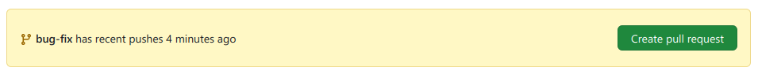
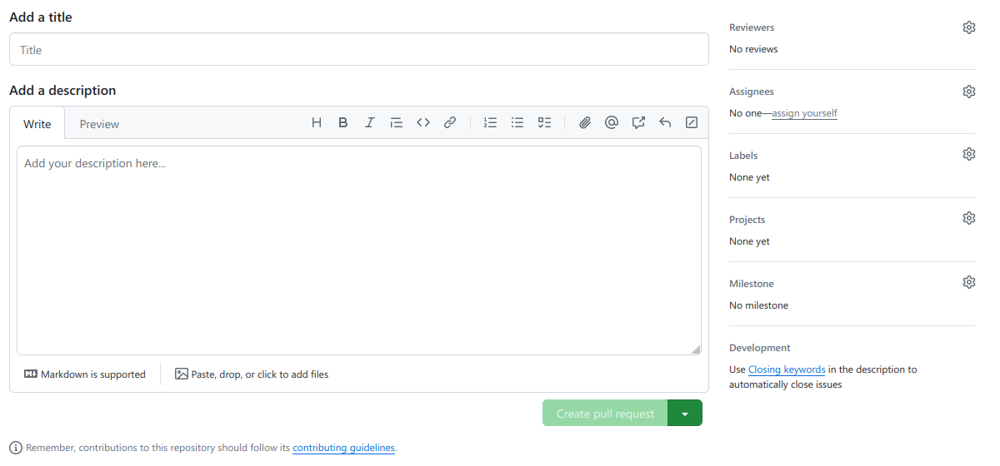

**This document is a work in progress**

# Contributing - Make changes to project
If you would like to make changes directly in the JCM repository, this is the right page! You'll find step by step instructions below.

## Making a fork
For (well obvious) reasons, you would not be able to make changes directly to the JCM Repository.  
Instead, you can make a fork of this JCM Repository, which will create a new clone in your account that you can freely manipulate with.

*To be done =w=*

## Where to start
- [Introduction to JCM Project Structure](Project_Structure.md)

### Code
- [Multiversion Development](Multiversion_Development.md)
- [Code Guidelines](Code_Guidelines.md)

## Submitting your change
Ok you've done the work, now what?  
Now, you can submit a **Pull Request**, which is essentially a request for your changes to be in the main JCM Repository.

Usually after you have pushed your change, you can go into your forked repository and GitHub will prompt you to submit a Pull Request.

You can click on that, then fill out the title and the description (Again don't stress yourself to write bunch of stuff, if it's a simple bug fix then 1-3 line is usually enough)

After that, click on the "Create Pull Request" button, and providing I still maintain the project I'll have a look at it.  
Feel free to ping if you don't get a response within 7 days.

If there's any changes that I would prefer to be made, I'll comment on that pull request and we can have a discussion there!

Otherwise, I'll probably approve and merge your changes to the main branch, where it will be added in the next JCM versions!